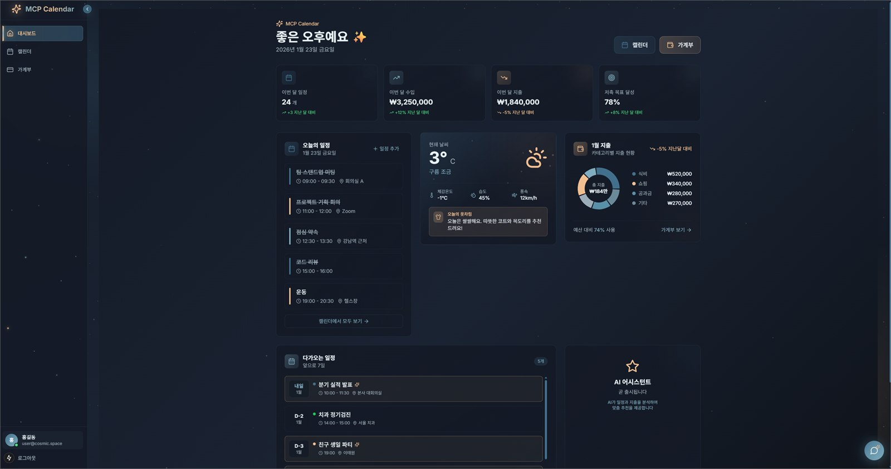
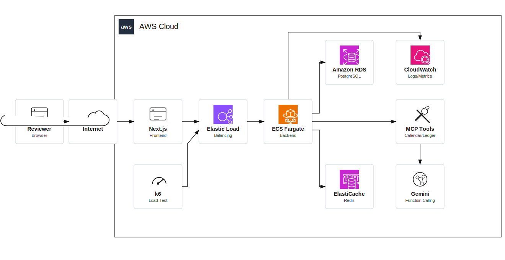
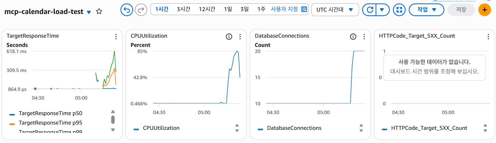

# MCP Calendar

> MCP와 LLM Function Calling을 활용해 자연어로 일정, 지출, 날씨 정보를 처리하는 캘린더/가계부 웹 애플리케이션

<p align="center">
  
</p>

## 프로젝트 개요

MCP Calendar는 사용자가 메뉴를 직접 탐색하지 않아도 자연어로 일정을 등록하고, 지출을 기록하고, 날씨 정보를 확인할 수 있도록 만든 웹 애플리케이션입니다. backend에는 MCP 도구 실행 구조를 두고, Gemini Function Calling을 통해 사용자의 의도를 일정, 가계부, 날씨 도구 호출로 연결했습니다.

이 프로젝트에서는 기능 구현뿐 아니라 AWS 배포 구조, 비용을 고려한 sprint 분리, 대용량 트래픽 대응, SSE streaming 안정화까지 함께 다뤘습니다.

## 문제 정의

개인 일정과 지출 정보는 자주 입력해야 하지만, 매번 화면을 이동하며 CRUD form을 채우는 방식은 사용성이 떨어집니다. 자연어 입력을 실제 서비스 데이터 처리로 연결하려면 LLM 응답을 그대로 믿는 것이 아니라, backend의 도구 실행 결과와 안전하게 연결하는 구조가 필요했습니다.

또한 cloud 배포를 진행할 때 처음부터 production-grade 리소스를 모두 상시 운영하면 비용 부담이 커질 수 있습니다. 기능 검증, Free Tier 검증, production-grade 실험을 분리해 비용이 커지는 구간을 먼저 파악할 필요가 있었습니다.

## 해결 방법

- MCP 도구를 일정, 가계부, 날씨 기능으로 나누고 Gemini Function Calling과 연결했습니다.
- backend에서 MCP 요청 처리, tool registry, Function Calling adapter, SSE streaming 응답 흐름을 구성했습니다.
- Terraform으로 ECS Fargate, ALB, RDS, ElastiCache, CloudWatch 기반 AWS 인프라를 구성했습니다.
- local PoC, AWS Free Tier 중심 검증, production-grade 확장 실험으로 sprint를 나누어 비용을 통제했습니다.
- k6 부하 테스트와 CloudWatch/ECS 지표를 보며 Auto Scaling, ALB Stickiness, Gemini Rate Limiting, HikariCP Fail Fast 설정을 점검했습니다.

## 주요 기능

- 자연어 기반 일정 등록, 조회, 수정, 삭제
- 자연어 기반 수입/지출 기록 및 월별 요약
- 날씨 조회와 의상 추천 도구
- Gemini Function Calling 기반 MCP 도구 호출
- SSE streaming 채팅 응답
- JWT 인증과 Redis 기반 세션/토큰 관리
- AWS ECS Fargate 기반 backend 배포 구성
- CloudWatch, k6, ECS 지표 기반 운영 점검

## 기술 스택

| 구분 | 기술 |
|---|---|
| Frontend | Next.js, React, TypeScript |
| Backend | Spring Boot, Kotlin, WebFlux |
| AI/LLM | Gemini API, Function Calling, MCP |
| Database | PostgreSQL, Redis |
| Cloud | AWS ECS Fargate, ALB, RDS, ElastiCache, CloudWatch |
| IaC/DevOps | Terraform, Docker, GitHub Actions, k6 |

## Architecture

<p align="center">
  
</p>

## 담당한 역할

이 프로젝트는 전체적으로 직접 구현한 프로젝트입니다. 포트폴리오에서는 특히 다음 역할을 중심으로 설명합니다.

- MCP 기반 도구 실행 구조 설계 및 구현
- Gemini Function Calling과 backend service 흐름 연결
- SSE streaming 응답과 CORS/proxy 문제 해결
- AWS Free Tier를 고려한 Terraform infrastructure 구성
- 비용을 고려한 sprint 분리와 단계적 cloud 확장
- k6/CloudWatch/ECS 지표 기반 대용량 트래픽 대응 점검

## 비용 최적화: 3-Sprint 배포 전략

설계 당시 production-grade 구성을 바로 상시 운영하면 월 $548 수준까지 비용이 커질 수 있다고 보고, 기능 검증과 cloud 검증을 3단계로 분리했습니다. 목표는 처음부터 모든 리소스를 오래 켜두는 것이 아니라, 필요한 범위만 열어 비용이 발생하는 지점을 확인하면서 확장하는 것이었습니다.

| 단계 | 목적 | 비용 기준 | 판단 |
|---|---|---:|---|
| Sprint 0 | Local PoC | $0 | Docker Compose로 MCP, LLM, CRUD 흐름을 먼저 검증 |
| Sprint 1 | Free Tier 검증 | $0 목표 | EC2/RDS Free Tier와 Vercel을 활용해 cloud 배포 흐름 확인 |
| Sprint 2 | Production-grade 실험 | AWS 비용 캡처 US$8.54 | ECS Fargate, ALB, RDS, CloudWatch, Auto Scaling까지 확장해 운영 이슈 점검 |

Cloudflare DNS 관련 비용까지 별도로 고려한 포트폴리오 산정 기준은 약 $19.42입니다. 단순히 전체 구성을 축소한 것이 아니라, local 검증과 Free Tier 검증을 먼저 거친 뒤 production-grade 실험 시간을 짧게 가져가면서 `$548/month` 기준 대비 약 96% 낮은 비용 구조를 목표로 잡았습니다.

<p align="center">
  
</p>

위 캡처는 2026-03-11부터 2026-03-13까지 AWS에서 배포 실험을 진행하며 비용과 서비스 사용량을 확인한 화면입니다.

## 문제 해결 과정

### MCP 도구 실행 결과 신뢰성

LLM이 도구 실행 중 발생한 오류를 성공 응답처럼 해석할 수 있는 문제가 있었습니다. backend에서 Function Response에 성공/실패 정보를 명확히 담고, Gemini system instruction에서 이 값을 확인하도록 설계해 사용자가 잘못된 완료 메시지를 받지 않도록 정리했습니다.

### SSE streaming과 CORS

채팅 streaming 요청이 backend를 직접 호출하면서 CORS 문제가 발생할 수 있었습니다. Next.js rewrite proxy와 backend CORS 설정을 함께 조정해 브라우저 요청 흐름을 안정화했습니다.

### 대용량 트래픽 대응

k6 부하 테스트와 CloudWatch/ECS 화면을 보며 ECS Auto Scaling, ALB Stickiness, Gemini Rate Limiting, HikariCP timeout을 점검했습니다. 특히 SSE 연결은 task scale-out 상황에서 연결 안정성이 중요하기 때문에 ALB stickiness를 함께 고려했습니다.

<p align="center">
  
</p>

<p align="center">
  
</p>

## Demo Evidence

<p align="center">
  
</p>

<p align="center">
  
</p>

<p align="center">
  
</p>

<p align="center">
  
</p>

## 실행 방법

```bash
git clone https://github.com/protove/MCP_calendar.git
cd MCP_calendar
docker-compose --env-file .env.dev up --build -d
```

환경 변수에는 Gemini API Key, weather API Key, database, Redis, JWT 관련 값이 필요합니다.

## 관련 링크

- GitHub: https://github.com/protove/MCP_calendar
