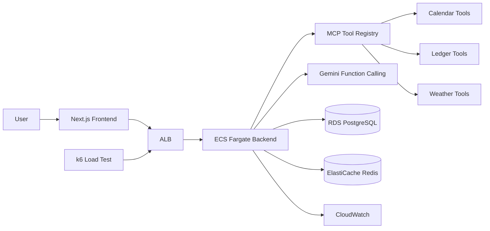
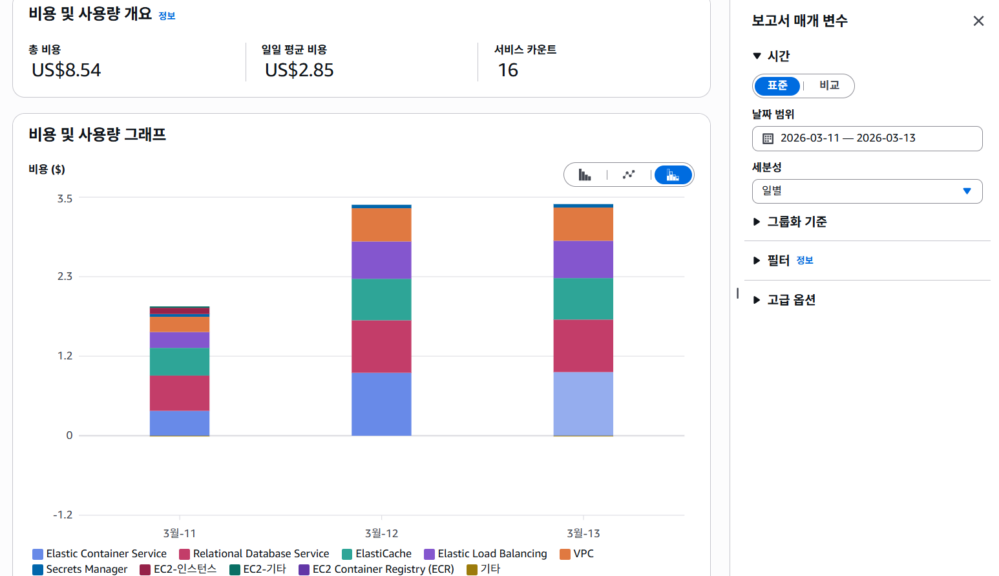
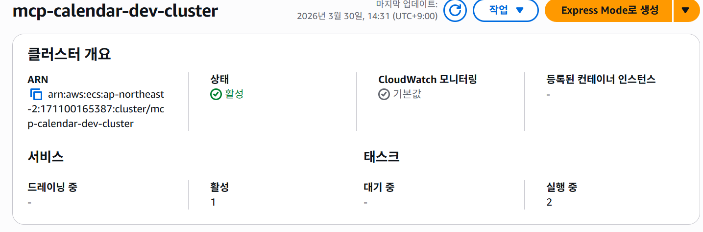
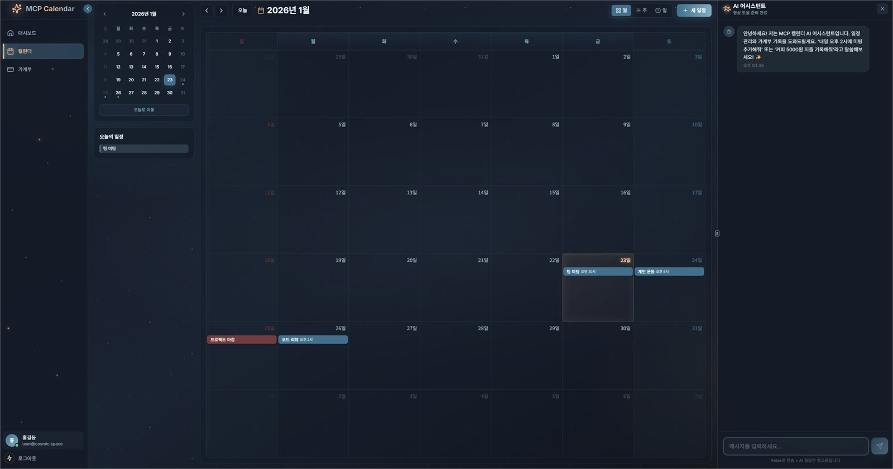
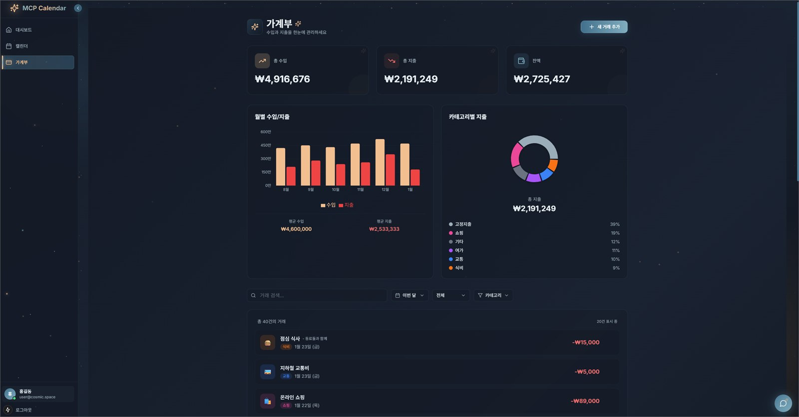
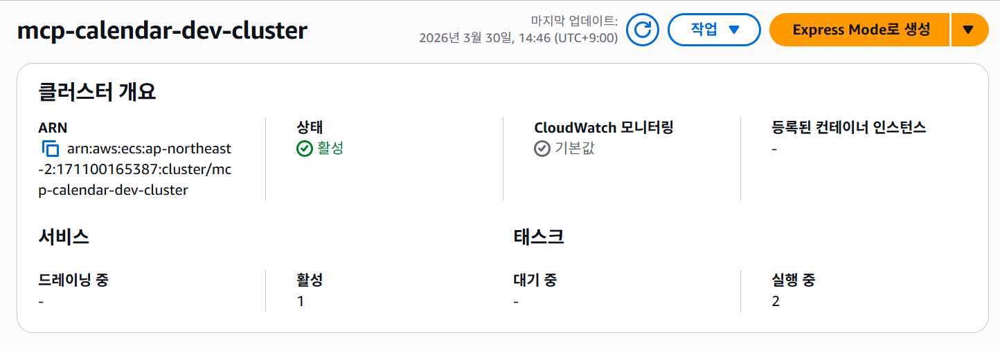

# MCP Calendar

> MCP?€ LLM Function Calling???쒖슜???먯뿰?대줈 ?쇱젙, 吏€異? ?좎뵪 ?뺣낫瑜?泥섎━?섎뒗 罹섎┛??媛€怨꾨? ???좏뵆由ъ??댁뀡

![MCP Calendar ?€?쒕낫??(docs/readme-assets/dashboard.jpg)

## ?꾨줈?앺듃 媛쒖슂

MCP Calendar???ъ슜?먭? 硫붾돱瑜?吏곸젒 ?먯깋?섏? ?딆븘???먯뿰?대줈 ?쇱젙???깅줉?섍퀬, 吏€異쒖쓣 湲곕줉?섍퀬, ?좎뵪 ?뺣낫瑜??뺤씤?????덈룄濡?留뚮뱺 ???좏뵆由ъ??댁뀡?낅땲?? backend?먮뒗 MCP ?꾧뎄 ?ㅽ뻾 援ъ“瑜??먭퀬, Gemini Function Calling???듯빐 ?ъ슜?먯쓽 ?섎룄瑜??쇱젙, 媛€怨꾨?, ?좎뵪 ?꾧뎄 ?몄텧濡??곌껐?덉뒿?덈떎.

???꾨줈?앺듃?먯꽌??湲곕뒫 援ы쁽肉??꾨땲??AWS 諛고룷, 鍮꾩슜??怨좊젮???④퀎??sprint 遺꾨━, ?€?⑸웾 ?몃옒???€?? SSE ?ㅽ듃由щ컢 ?덉젙?붽퉴吏€ ?④퍡 ?ㅻ쨾?듬땲??

## 臾몄젣 ?뺤쓽

媛쒖씤 ?쇱젙怨?吏€異??뺣낫???ъ슜?먭? 諛섎났?곸쑝濡??낅젰?댁빞 ?섎뒗 ?곗씠?곗엯?덈떎. ?쇰컲?곸씤 CRUD ?붾㈃留뚯쑝濡쒕뒗 ?낅젰 ?먮쫫??踰덇굅濡?퀬, AI媛€ ?ㅼ젣 ?쒕퉬???곗씠?곗뿉 ?묎렐?섎젮硫?LLM ?묐떟怨?backend ?꾧뎄 ?ㅽ뻾???덉쟾?섍쾶 ?곌껐?섎뒗 援ъ“媛€ ?꾩슂?덉뒿?덈떎.

?먰븳 cloud 諛고룷瑜?吏꾪뻾???뚮뒗 泥섏쓬遺€??臾닿굅??production 援ъ“瑜??щ━湲곕낫?? 鍮꾩슜???듭젣?섎㈃???④퀎?곸쑝濡?寃€利앺븷 ???덈뒗 諛⑹떇???꾩슂?덉뒿?덈떎.

## ?닿껐 諛⑸쾿

- MCP ?꾧뎄瑜??쇱젙, 媛€怨꾨?, ?좎뵪 湲곕뒫?쇰줈 ?섎늻怨?Gemini Function Calling怨??곌껐?덉뒿?덈떎.
- backend?먯꽌 MCP ?붿껌 泥섎━, ?꾧뎄 registry, Function Calling adapter, SSE streaming ?묐떟 ?먮쫫??援ъ꽦?덉뒿?덈떎.
- Terraform?쇰줈 ECS Fargate, ALB, RDS, ElastiCache, CloudWatch 湲곕컲 AWS ?명봽?쇰? 援ъ꽦?덉뒿?덈떎.
- 鍮꾩슜???섏떇??local PoC, AWS Free Tier 以묒떖 寃€利? production-grade ?뺤옣 ?ㅽ뿕?쇰줈 sprint瑜??섎늻??吏꾪뻾?덉뒿?덈떎.
- k6 遺€???뚯뒪?몄? CloudWatch/ECS 吏€?쒕? 蹂대ʼn Auto Scaling, ALB Stickiness, Gemini Rate Limiting, HikariCP Fail Fast ?ㅼ젙???먭??덉뒿?덈떎.

## 二쇱슂 湲곕뒫

- ?먯뿰??湲곕컲 ?쇱젙 ?깅줉, 議고쉶, ?섏젙, ??젣
- ?먯뿰??湲곕컲 ?섏엯/吏€異?湲곕줉 諛??붾퀎 ?붿빟
- ?좎뵪 議고쉶?€ ?섏긽 異붿쿇 ?꾧뎄
- Gemini Function Calling 湲곕컲 MCP ?꾧뎄 ?몄텧
- SSE streaming 梨꾪똿 ?묐떟
- JWT ?몄쬆怨?Redis 湲곕컲 ?몄뀡/?좏겙 愿€由?- AWS ECS Fargate 湲곕컲 backend 諛고룷 援ъ꽦
- CloudWatch, k6, ECS 吏€??湲곕컲 ?댁쁺 ?먭?

## 湲곗닠 ?ㅽ깮

| 援щ텇 | 湲곗닠 |
|---|---|
| Frontend | Next.js, React, TypeScript |
| Backend | Spring Boot, Kotlin, WebFlux |
| AI/LLM | Gemini API, Function Calling, MCP |
| Database | PostgreSQL, Redis |
| Cloud | AWS ECS Fargate, ALB, RDS, ElastiCache, CloudWatch |
| IaC/DevOps | Terraform, Docker, GitHub Actions, k6 |

## Architecture



## ?닿? ?대떦????븷

???꾨줈?앺듃???꾩껜?곸쑝濡?吏곸젒 援ы쁽???꾨줈?앺듃?낅땲?? ?ы듃?대━?ㅼ뿉?쒕뒗 ?뱁엳 ?ㅼ쓬 ??븷??以묒떖?쇰줈 ?ㅻ챸?⑸땲??

- MCP 湲곕컲 ?꾧뎄 ?ㅽ뻾 援ъ“ ?ㅺ퀎 諛?援ы쁽
- Gemini Function Calling怨?backend service ?먮쫫 ?곌껐
- SSE streaming ?묐떟怨?CORS/proxy 臾몄젣 ?닿껐
- AWS Free Tier瑜?怨좊젮??Terraform infrastructure 援ъ꽦
- 鍮꾩슜??怨좊젮??sprint 遺꾨━?€ ?④퀎??cloud ?뺤옣
- k6/CloudWatch/ECS 吏€??湲곕컲 ?€?⑸웾 ?몃옒???€???먭?

## 鍮꾩슜??怨좊젮??sprint 遺꾨━

MCP Calendar??湲곕뒫 援ы쁽怨?cloud 諛고룷瑜???踰덉뿉 諛€?대텤?닿린蹂대떎 鍮꾩슜 遺€?댁쓣 以꾩씠湲??꾪빐 ?④퀎瑜??섎늻??吏꾪뻾?덉뒿?덈떎.

| ?④퀎 | 紐⑹쟻 | ?듭떖 ?먮떒 |
|---|---|---|
| Sprint 0 | Local PoC | Docker Compose 湲곕컲?쇰줈 MCP, LLM, CRUD ?먮쫫??癒쇱? 寃€利?|
| Sprint 1 | Free Tier 寃€利?| AWS Free Tier ?€??由ъ냼?ㅻ? ?곗꽑 ?좏깮?섍퀬 Terraform IaC濡?諛고룷 ?먮쫫 ?뺣━ |
| Sprint 2 | Production-grade ?ㅽ뿕 | ECS Fargate, RDS, ALB, CloudWatch, Auto Scaling源뚯? ?뺤옣?섎ʼn ?댁쁺 ?댁뒋 ?먭? |



鍮꾩슜 ?붾㈃?€ AWS 諛고룷 ?ㅽ뿕 湲곌컙??鍮꾩슜怨??쒕퉬???ъ슜?됱쓣 ?뺤씤?섍린 ?꾪빐 ?④릿 evidence?낅땲?? README?먯꽌?????대?吏€瑜?鍮꾩슜??怨좊젮??cloud ?ㅽ뿕??吏꾪뻾?덈떎??蹂댁“ 洹쇨굅濡??ъ슜?⑸땲??

## 臾몄젣 ?닿껐 怨쇱젙

### MCP ?꾧뎄 ?ㅽ뻾 寃곌낵 ?좊ː??
LLM???꾧뎄 ?ㅽ뻾 以?諛쒖깮???ㅻ쪟瑜??깃났 ?묐떟泥섎읆 ?댁꽍?????덈뒗 臾몄젣媛€ ?덉뿀?듬땲?? backend?먯꽌 Function Response???깃났/?ㅽ뙣 ?뺣낫瑜?紐낇솗???닿퀬, Gemini system instruction?먯꽌 ??媛믪쓣 ?뺤씤?섎룄濡??ㅺ퀎???ъ슜?먭? ?섎せ???꾨즺 硫붿떆吏€瑜?諛쏆? ?딅룄濡??뺣━?덉뒿?덈떎.

### SSE streaming怨?CORS

梨꾪똿 streaming ?붿껌??backend瑜?吏곸젒 ?몄텧?섎㈃??CORS 臾몄젣媛€ 諛쒖깮?????덉뿀?듬땲?? Next.js rewrite proxy?€ backend CORS ?ㅼ젙???④퍡 議곗젙??釉뚮씪?곗? ?붿껌 ?먮쫫???덉젙?뷀뻽?듬땲??

### ?€?⑸웾 ?몃옒???€??
k6 遺€???뚯뒪?몄? CloudWatch/ECS ?붾㈃??蹂대ʼn ECS Auto Scaling, ALB Stickiness, Gemini Rate Limiting, HikariCP timeout???먭??덉뒿?덈떎. ?뱁엳 SSE ?곌껐?€ task scale-out ?곹솴?먯꽌 ?곌껐 ?덉젙?깆씠 以묒슂?섍린 ?뚮Ц??ALB stickiness瑜??④퍡 怨좊젮?덉뒿?덈떎.

![k6 CloudWatch 吏€??(docs/readme-assets/k6-traffic-test-cloudwatch.png)



## Demo Evidence







## ?ㅽ뻾 諛⑸쾿

```bash
git clone https://github.com/protove/MCP_calendar.git
cd MCP_calendar
docker-compose --env-file .env.dev up --build -d
```

?섍꼍 蹂€?섏뿉??Gemini API Key, weather API Key, database, Redis, JWT 愿€??媛믪씠 ?꾩슂?⑸땲??

## 愿€??留곹겕

- GitHub: https://github.com/protove/MCP_calendar

